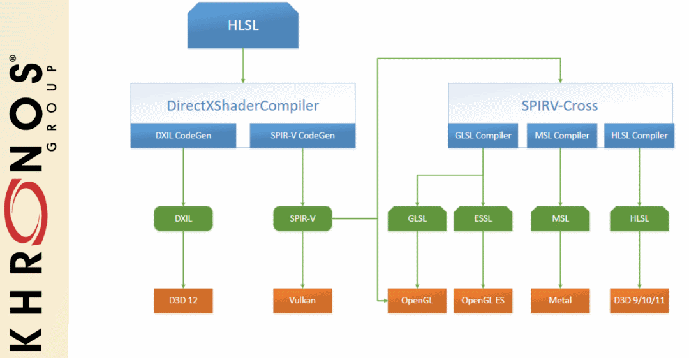

# What is SPIR-V

[SPIR-V](https://www.khronos.org/registry/spir-v/) is a binary intermediate representation for graphical-shader stages and compute kernels. With Vulkan, you can still write your shaders in a high level language such as GLSL, but a SPIR-V binary is needed when using [vkCreateShaderModule](https://www.khronos.org/registry/vulkan/specs/1.1/html/vkspec.html#vkCreateShaderModule). The Vulkan SDK has a very nice [white paper](https://www.khronos.org/registry/spir-v/papers/WhitePaper.pdf) about SPIR-V and its advantages, and a high-level description of the representation. There are also two great Khronos presentations from Vulkan DevDay 2016 [here](https://www.khronos.org/assets/uploads/developers/library/2016-vulkan-devday-uk/3-Intro-to-spir-v-shaders.pdf) and [here](https://www.khronos.org/assets/uploads/developers/library/2016-vulkan-devday-uk/4-Using-spir-v-with-spirv-cross.pdf)
([video of both](https://www.youtube.com/watch?v=XRpVwdduzgU)).

## SPIR-V Interface and Capabilities

Vulkan has an entire section that defines how [Vulkan interfaces with SPIR-V shaders](https://www.khronos.org/registry/vulkan/specs/1.1/html/vkspec.html#interfaces). Most valid usages of interfacing with SPIR-V occur during pipeline creation when shaders are compiled together.

SPIR-V has many capabilities as it has other targets then just Vulkan. To see the supported capabilities Vulkan requires, one can reference the [Appendix](https://www.khronos.org/registry/vulkan/specs/1.1/html/vkspec.html#spirvenv-capabilities). Some extensions and features in Vulkan are just designed to check if some SPIR-V capabilities are supported or not.

## Compilers

### glslang

[glslang](https://github.com/KhronosGroup/glslang) is the Khronos reference front-end for GLSL and ESSL, and sample SPIR-V generator. There is a standalone `glslangValidator` tool that is included that can be used to create SPIR-V from GLSL and ESSL.

### Shaderc

A collection of tools, libraries, and tests for Vulkan shader compilation hosted by Google. It contains `glslc` which wraps around core functionality in [glslang](https://github.com/KhronosGroup/glslang) and [SPIRV-Tools](https://github.com/KhronosGroup/SPIRV-Tools). Shaderc also contains `spvc` which wraps around core functionality in [SPIRV-Cross](https://github.com/KhronosGroup/SPIRV-Cross) and [SPIRV-Tools](https://github.com/KhronosGroup/SPIRV-Tools).

Shaderc builds both tools as a standalone command line tool ([glslc](https://github.com/google/shaderc/tree/master/glslc) and [spvc](https://github.com/google/shaderc/tree/master/spvc)) as well as a library to link to ([libshaderc](https://github.com/google/shaderc/tree/master/libshaderc) and [libshaderc_spvc](https://github.com/google/shaderc/tree/master/libshaderc_spvc)).

### DXC

[DirectXShaderCompiler](https://github.com/microsoft/DirectXShaderCompiler) also supports [translating HLSL into the SPIR-V](https://github.com/Microsoft/DirectXShaderCompiler/wiki/SPIR%E2%80%90V-CodeGen
).

### Clspv

[Clspv](https://github.com/google/clspv) is a prototype compiler for a subset of OpenCL C to SPIR-V to be used as Vulkan compute shaders.

## Tools and Ecosystem

There is a rich ecosystem of tools to take advantage of SPIR-V. The [Vulkan SDK gives an overview](https://vulkan.lunarg.com/doc/sdk/latest/windows/spirv_toolchain.html) of all the SPIR-V tools that are built and packaged for developers.

### SPIRV-Tools

The Khronos [SPIRV-Tools](https://github.com/KhronosGroup/SPIRV-Tools) project provides C and C++ APIs and a command line interface to work with SPIR-V modules. The set of tools contains

- Assembler (`spirv-as`)
- Disassembler (`spirv-dis`)
- Validator (`spirv-val`)
- Linker (`spirv-link`)
- Optimizer (`spirv-opt`)
    - LunarG wrote a [white paper](https://www.lunarg.com/wp-content/uploads/2018/06/SPIR-V-Shader-Legalization-and-Size-Reduction-Using-spirv-opt_v1.2.pdf) about `spriv-opt`
- Reducer (`spirv-reduce`)
- Control flow dumper (`spirv-cfg`)

### SPIRV-Cross

The Khronos [SPIRV-Cross](https://github.com/KhronosGroup/SPIRV-Cross) project is a practical tool and library for performing reflection on SPIR-V and disassembling SPIR-V back to high level languages. For more details, Hans Kristian, the main developer of SPIR-V Cross, has given two great presentations about what it takes to create a tool such as SPIR-V Cross from [2018 Vulkanise](https://www.khronos.org/assets/uploads/developers/library/2018-vulkanised/04-SPIRVCross_Vulkanised2018.pdf) ([video](https://www.youtube.com/watch?v=T5Va6hSGx44)) and [2019 Vulkanise](https://www.khronos.org/assets/uploads/developers/library/2019-vulkanised/04-SPIRV-Cross-May19.pdf) ([video](https://www.youtube.com/watch?v=lv-fh_oFJUc))

### SPIRV-LLVM

The Khronos [SPIRV-LLVM](https://github.com/KhronosGroup/SPIRV-LLVM) project is a LLVM framework with SPIR-V support. It's intended to contain a bi-directional converter between LLVM and SPIR-V. It also serves as a foundation for LLVM-based front-end compilers targeting SPIR-V.
