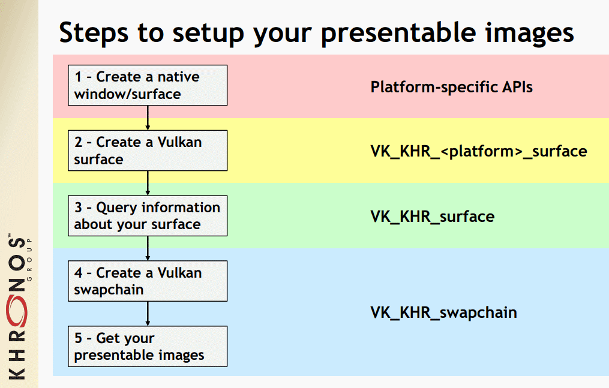
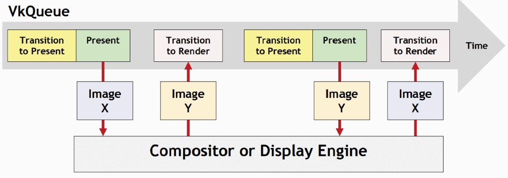

# Window System Integration (WSI)

Since the Vulkan API can be used without displaying results, WSI is provided through the use of [optional Vulkan extensions](https://www.khronos.org/registry/vulkan/specs/1.2-extensions/html/vkspec.html#wsi). Most implementations will include WSI support. The WSI design was created to abstract each platform's windowing mechanism from the core Vulkan API.

## Surface

The `VkSurfaceKHR` object is platform agnostic and designed so the rest of the Vulkan API can use it for all WSI operations. It is enabled using the `VK_KHR_surface` extension.

Each platform that supports a Vulkan Surface has its own way to create a `VkSurfaceKHR` object from its respective platform-specific API.

- Android - [vkCreateAndroidSurfaceKHR](https://www.khronos.org/registry/vulkan/specs/1.2-extensions/html/vkspec.html#vkCreateAndroidSurfaceKHR)
- DirectFB - [vkCreateDirectFBSurfaceEXT](https://www.khronos.org/registry/vulkan/specs/1.2-extensions/html/vkspec.html#vkCreateDirectFBSurfaceEXT)
- Fuchsia - [vkCreateImagePipeSurfaceFUCHSIA](https://www.khronos.org/registry/vulkan/specs/1.2-extensions/html/vkspec.html#vkCreateImagePipeSurfaceFUCHSIA)
- Google Games - [vkCreateStreamDescriptorSurfaceGGP](https://www.khronos.org/registry/vulkan/specs/1.2-extensions/html/vkspec.html#vkCreateStreamDescriptorSurfaceGGP)
- iOS - [vkCreateIOSSurfaceMVK](https://www.khronos.org/registry/vulkan/specs/1.2-extensions/html/vkspec.html#vkCreateIOSSurfaceMVK)
- macOS - [vkCreateMacOSSurfaceMVK](https://www.khronos.org/registry/vulkan/specs/1.2-extensions/html/vkspec.html#vkCreateMacOSSurfaceMVK)
- Metal - [vkCreateMetalSurfaceEXT](https://www.khronos.org/registry/vulkan/specs/1.2-extensions/html/vkspec.html#vkCreateMetalSurfaceEXT)
- VI - [vkCreateViSurfaceNN](https://www.khronos.org/registry/vulkan/specs/1.2-extensions/html/vkspec.html#vkCreateViSurfaceNN)
- Wayland - [vkWaylandSurfaceCreateInfoKHR](https://www.khronos.org/registry/vulkan/specs/1.2-extensions/html/vkspec.html#vkWaylandSurfaceCreateInfoKHR)
- Windows - [vkCreateWin32SurfaceKHR](https://www.khronos.org/registry/vulkan/specs/1.2-extensions/html/vkspec.html#vkCreateWin32SurfaceKHR)
- XCB - [vkCreateXcbSurfaceKHR](https://www.khronos.org/registry/vulkan/specs/1.2-extensions/html/vkspec.html#vkCreateXcbSurfaceKHR)
- Xlib - [vkCreateXlibSurfaceKHR](https://www.khronos.org/registry/vulkan/specs/1.2-extensions/html/vkspec.html#vkCreateXlibSurfaceKHR)
- Direct-to-Display - [vkCreateDisplayPlaneSurfaceKHR](https://www.khronos.org/registry/vulkan/specs/1.2-extensions/html/vkspec.html#vkCreateDisplayPlaneSurfaceKHR)

Once a `VkSurfaceKHR` is created there are various [capabilities](https://www.khronos.org/registry/vulkan/specs/1.2-extensions/html/vkspec.html#vkGetPhysicalDeviceSurfaceCapabilitiesKHR), [formats](https://www.khronos.org/registry/vulkan/specs/1.2-extensions/html/vkspec.html#vkGetPhysicalDeviceSurfaceFormatsKHR), and [presentation modes](https://www.khronos.org/registry/vulkan/specs/1.2-extensions/html/vkspec.html#vkGetPhysicalDeviceSurfacePresentModesKHR) to query for.

## Swapchain

The `VkSwapchainKHR` object provides the ability to present rendering results to a surface through an array of `VkImage` objects. The swapchain's various [present modes](https://www.khronos.org/registry/vulkan/specs/1.2-extensions/html/vkspec.html#VkPresentModeKHR) determine how the presentation engine is implemented.

Khronos' [sample](https://github.com/KhronosGroup/Vulkan-Samples/tree/master/samples/performance/swapchain_images) and [tutorial](https://github.com/KhronosGroup/Vulkan-Samples/blob/master/samples/performance/swapchain_images/swapchain_images_tutorial.md) explain different considerations to make when creating a swapchain and selecting a presentation mode.

## Pre-Rotation

Mobile devices can be rotated, therefore the logical orientation of the application window and the physical orientation of the display may not match. Applications need to be able to operate in two modes: `portrait` and `landscape`. The difference between these two modes can be simplified to just a change in resolution. However, some display subsystems always work on the "native" (or "physical") orientation of the display panel. Since the device has been rotated, to achieve the desired effect the application output must also rotate.

In order for your application to get the most out of Vulkan on mobile platforms, such as Android, implementing pre-rotation is a must. There is a [detailed blog post from Google](https://android-developers.googleblog.com/2020/02/handling-device-orientation-efficiently.html?m=1) that goes over how to handle the surface rotation by specifying the orientation during swapchain creation and also comes with a [standalone example](https://github.com/google/vulkan-pre-rotation-demo). The [Vulkan-Samples](https://github.com/KhronosGroup/Vulkan-Samples) also has both a [great write up](https://github.com/KhronosGroup/Vulkan-Samples/blob/master/samples/performance/surface_rotation/surface_rotation_tutorial.md) of why pre-rotation is a problem as well as [a sample to run](https://github.com/KhronosGroup/Vulkan-Samples/tree/master/samples/performance/surface_rotation) that shows a way to solve it in the shader.
